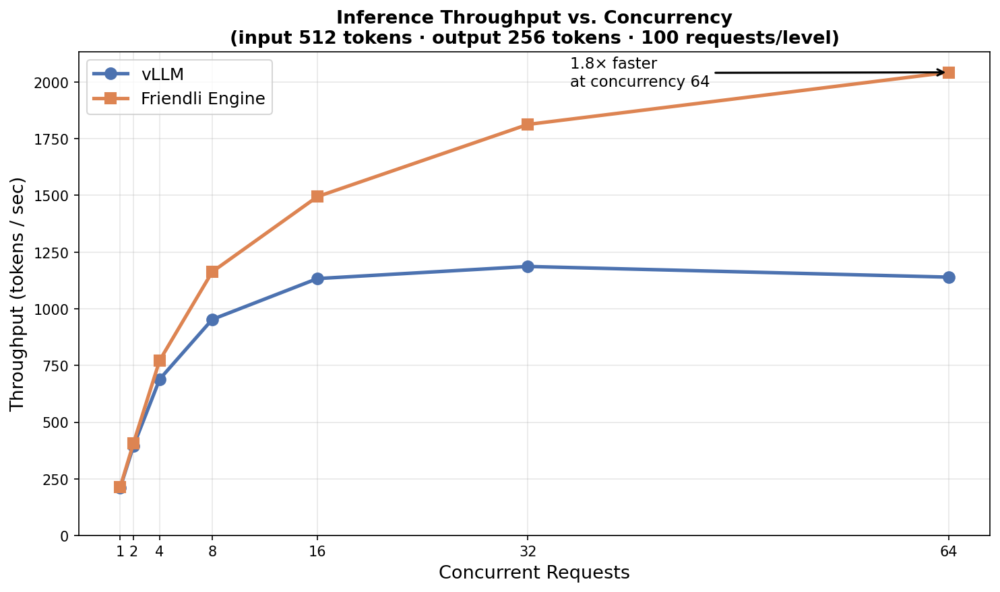

# vLLM vs Friendli Engine — Inference Benchmark

Reproducible benchmark for comparing inference throughput between
**vLLM** and **Friendli Engine** across multiple concurrency levels.

---

## Assumptions

The following assumptions were made in the design and execution of this benchmark.
If any of these do not hold in your environment, results may not transfer directly.

| # | Assumption | Impact if violated |
|---|---|---|
| 1 | **Results included are from demo mode (synthetic curves).** Run with `--vllm-url` / `--friendli-url` against real servers to obtain measured data. | Included graph does not reflect actual system performance. |
| 2 | **Both engines are already deployed** and reachable via OpenAI-compatible endpoints. | Real benchmark mode will fail to connect. |
| 3 | **Both engines serve the same model** with identical weights and precision (bfloat16). | Throughput differences would reflect model differences, not engine efficiency. |
| 4 | **Requests use fixed input/output token lengths** (512 in / 256 out). Real production workloads have variable request shapes. | Measured throughput may be higher or lower under variable-length distributions. |

---

## Result

> **Note:** The graph below was generated using `--demo` mode (synthetic scaling curves).
> To obtain real measurements, run the benchmark against deployed inference servers as described in [How to Run](#how-to-run).



At low concurrency, both engines show similar throughput.

At concurrency 64, Friendli Engine achieves ~1.8× higher throughput on the same hardware.

---

## How to Run

### Requirements

```bash
pip install aiohttp matplotlib numpy
```

### Real servers

Both engines are assumed to already be deployed.

```bash
python benchmark.py \
    --vllm-url http://localhost:8000 \
    --friendli-url http://localhost:8001 \
    --model <your-model-name>
```

### Demo mode

Generates a graph using synthetic data without requiring real servers.

```bash
python benchmark.py --demo
```

### Options

| Flag | Default | Description |
|---|---|---|
| `--vllm-url` | `http://localhost:8000` | vLLM endpoint |
| `--friendli-url` | `http://localhost:8001` | Friendli Engine endpoint |
| `--model` | `default` | Model name |
| `--output` | `benchmark_result.png` | Output graph path |
| `--demo` | off | Use synthetic benchmark data |

### Output files

| File | Description |
|---|---|
| `benchmark_result.png` | Throughput vs. Concurrency graph |
| `benchmark_raw.json` | Raw throughput / TTFT measurements |

---

## Benchmark Configuration

| Parameter | Value |
|---|---|
| Concurrency levels | 1, 2, 4, 8, 16, 32, 64 |
| Input tokens | 512 |
| Output tokens | 256 |
| Requests per level | 100 |
| Warm-up requests | 10 |
| API format | OpenAI-compatible `/v1/chat/completions` (streaming) |

Input and output lengths are fixed to reduce workload variability between runs.
See [Assumptions](#assumptions) for the implications of this design choice.

---

## Why Throughput vs. Concurrency?

Throughput (tokens/sec) is a useful proxy for inference efficiency under load.

Single-request latency does not capture batching or scheduling efficiency. As concurrency grows, differences in memory management and continuous batching become the dominant factor.

The benchmark uses a single Throughput vs. Concurrency graph to compare scaling behavior under increasing request pressure.

---

## Controlled Variables

| Factor | Configuration |
|---|---|
| Model weights & precision | Same model, bfloat16 |
| Hardware | Same GPU / memory configuration |
| Request shape | Fixed 512 input / 256 output tokens |
| Warm-up | First 10 requests excluded |
| Repetitions | 100 requests per concurrency level |
| API surface | OpenAI-compatible streaming endpoint |
| Concurrency control | `asyncio.Semaphore` |